# Dynamic IPAM Implementation Proposal for KubeSlice Controller

## Executive Summary

This document presents a comprehensive technical proposal for implementing Dynamic IP Address Management (IPAM) in the KubeSlice Controller. The solution addresses critical inefficiencies in the current static subnet allocation approach by providing on-demand subnet allocation, automatic reclamation, and intelligent conflict resolution.

## Table of Contents

1. [Problem Analysis](#problem-analysis)
2. [Solution Architecture](#solution-architecture)
3. [Component Design](#component-design)
4. [Implementation Phases](#implementation-phases)
5. [Data Flow Diagrams](#data-flow-diagrams)
6. [State Management](#state-management)
7. [Integration Points](#integration-points)
8. [Security Considerations](#security-considerations)
9. [Testing Strategy](#testing-strategy)
10. [Migration Path](#migration-path)
11. [Performance Considerations](#performance-considerations)
12. [Future Enhancements](#future-enhancements)

## Problem Analysis

### Current Static IPAM Limitations

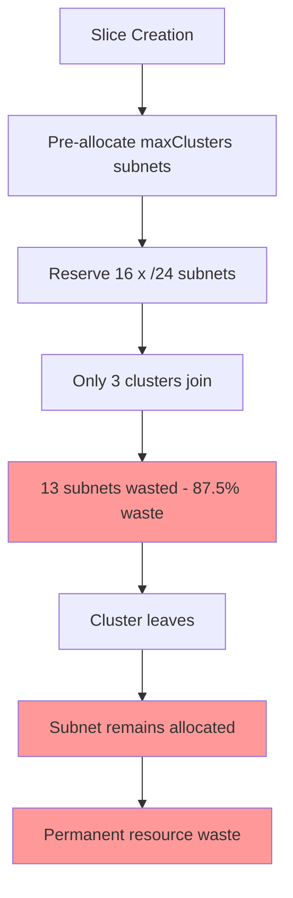

### Resource Utilization Analysis

| Scenario | Static IPAM | Dynamic IPAM | Efficiency Gain |
|----------|-------------|--------------|-----------------|
| 3/16 clusters | 524,288 IPs reserved | 768 IPs allocated | 99.85% |
| 5/32 clusters | 2,097,152 IPs reserved | 1,280 IPs allocated | 99.94% |
| 1/8 clusters | 131,072 IPs reserved | 256 IPs allocated | 99.8% |

## Solution Architecture

### High-Level Architecture

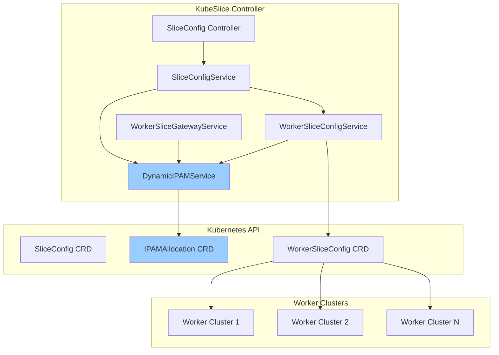

### Component Interaction Model

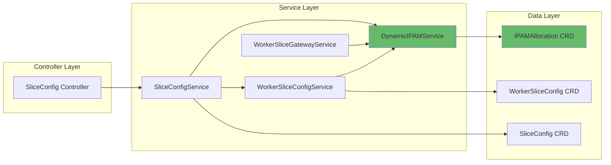

## Component Design

### 1. IPAMAllocation Custom Resource Definition

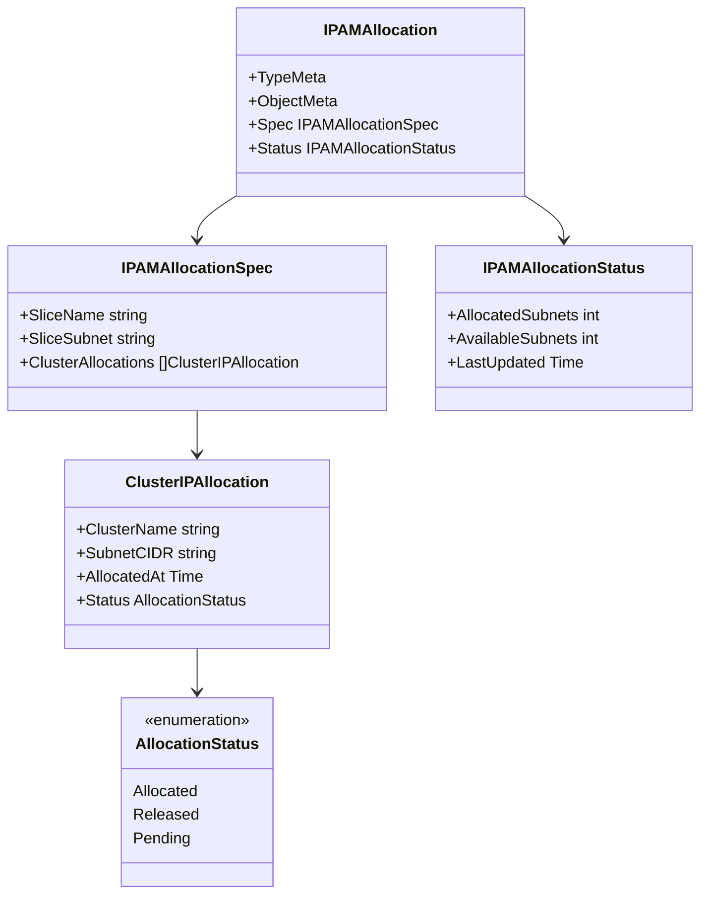

### 2. DynamicIPAMService Interface

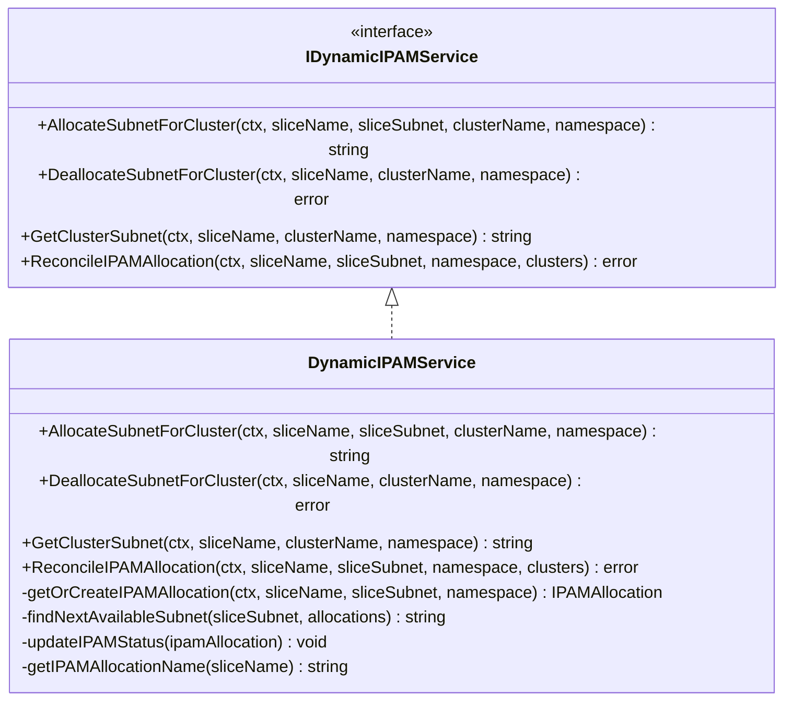

### 3. Enhanced SliceConfig Integration

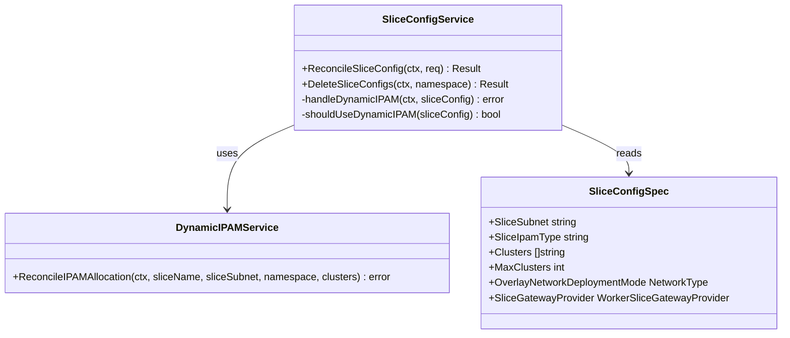

## Implementation Phases

### Phase 1: Core Infrastructure

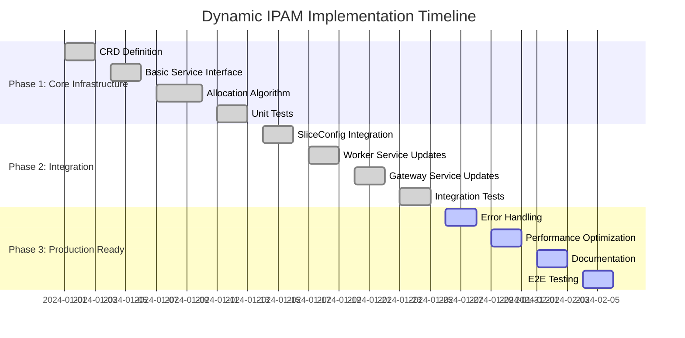

### Phase 1: Core Infrastructure Components

1. **IPAMAllocation CRD**
   - Define custom resource schema
   - Implement validation webhooks
   - Add to scheme registration

2. **DynamicIPAMService**
   - Core allocation/deallocation logic
   - Subnet calculation algorithms
   - State management operations

3. **Basic Integration**
   - Service interface definition
   - Error handling patterns
   - Logging and metrics

### Phase 2: Service Integration

1. **SliceConfigService Enhancement**
   - Dynamic IPAM detection logic
   - Reconciliation integration
   - Migration compatibility

2. **WorkerSliceConfigService Updates**
   - Dynamic subnet allocation
   - Worker config generation
   - Cluster-specific configurations

3. **WorkerSliceGatewayService Integration**
   - Gateway network configuration
   - Subnet-aware routing
   - Address resolution

### Phase 3: Production Readiness

1. **Robust Error Handling**
   - Conflict resolution
   - Recovery mechanisms
   - Graceful degradation

2. **Performance Optimization**
   - Efficient subnet calculations
   - Resource caching
   - Batch operations

3. **Comprehensive Testing**
   - Unit test coverage
   - Integration scenarios
   - End-to-end validation

## Data Flow Diagrams

### Subnet Allocation Flow

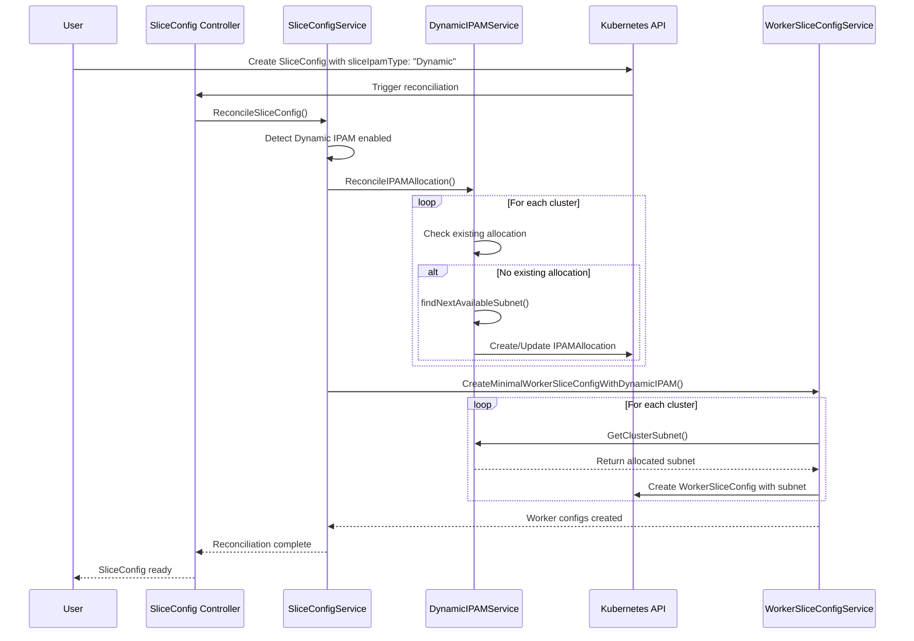

### Subnet Deallocation Flow

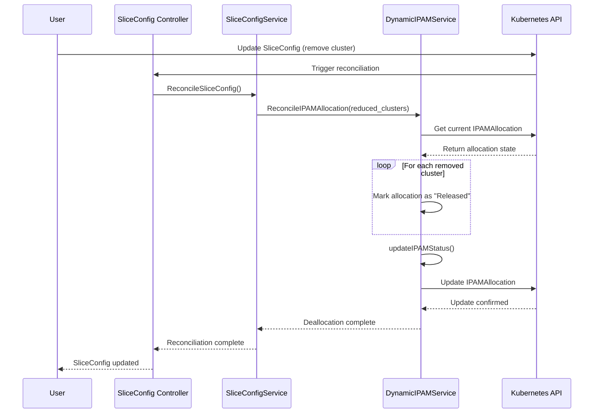

### Cluster Join Process

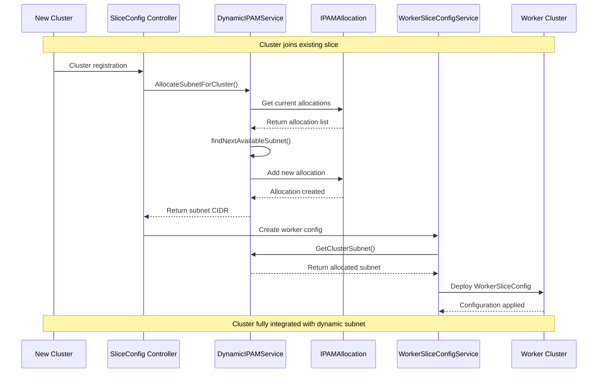

## State Management

### IPAMAllocation State Transitions

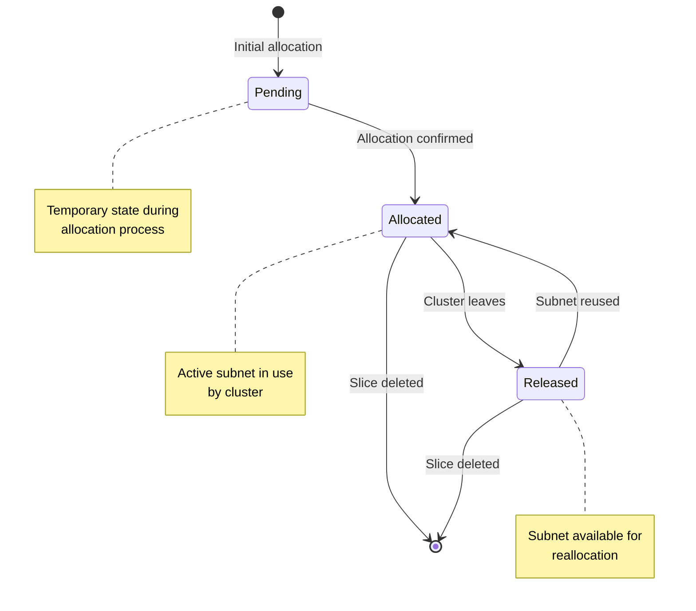

### Slice Lifecycle with Dynamic IPAM

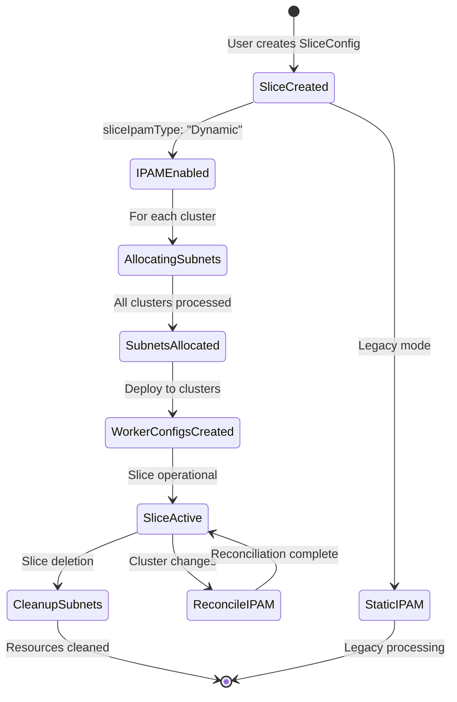

### Allocation Algorithm State

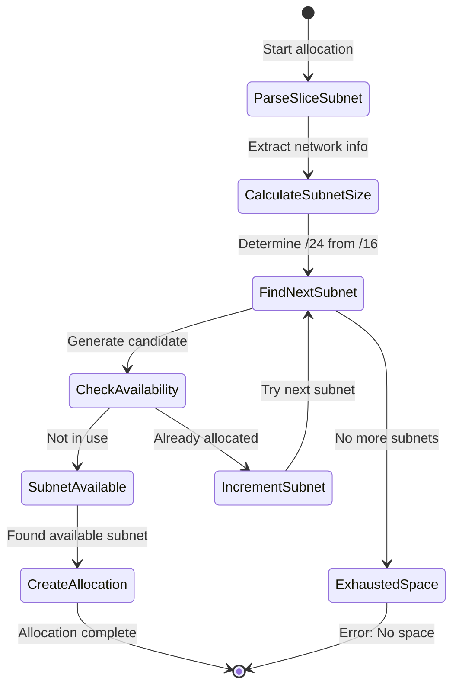

## Integration Points

### SliceConfig Integration

```mermaid
graph TD
    subgraph "SliceConfig Processing"
        A[SliceConfig Created/Updated]
        B{sliceIpamType == "Dynamic"?}
        C[Use Dynamic IPAM]
        D[Use Static IPAM]
        E[ReconcileIPAMAllocation]
        F[Create Worker Configs]
        G[Static Subnet Calculation]
        H[Create Worker Configs]
    end
    
    A --> B
    B -->|Yes| C
    B -->|No/Unset| D
    C --> E
    E --> F
    D --> G
    G --> H
    
    style C fill:#a8e6cf
    style E fill:#a8e6cf
    style F fill:#a8e6cf
```

### Service Dependencies

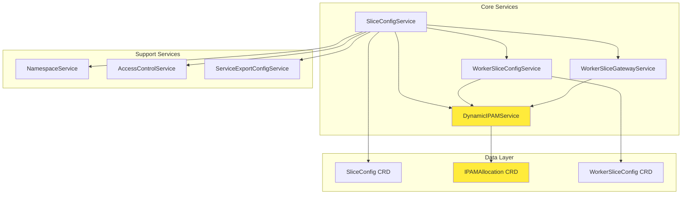

### Controller Integration

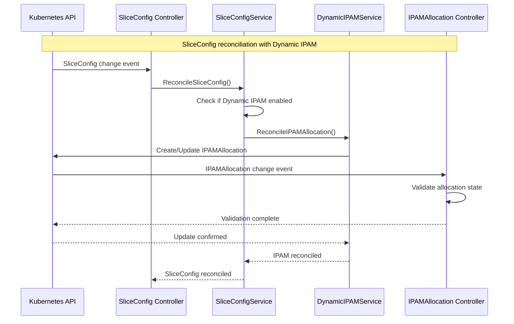

## Security Considerations

### RBAC Permissions

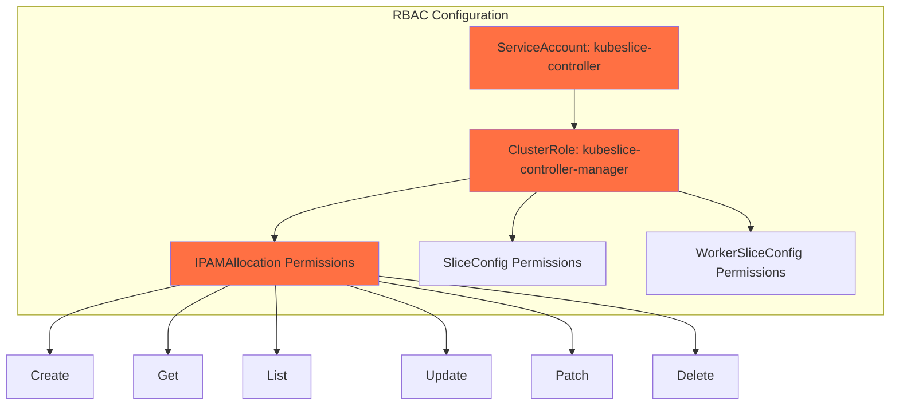

### Data Protection

| Component | Data Type | Protection Mechanism |
|-----------|-----------|---------------------|
| IPAMAllocation | Subnet allocations | Kubernetes etcd encryption |
| SliceConfig | Network configuration | RBAC access control |
| Service communication | API calls | TLS encryption |
| Allocation state | CRD status | Field-level validation |

### Threat Model

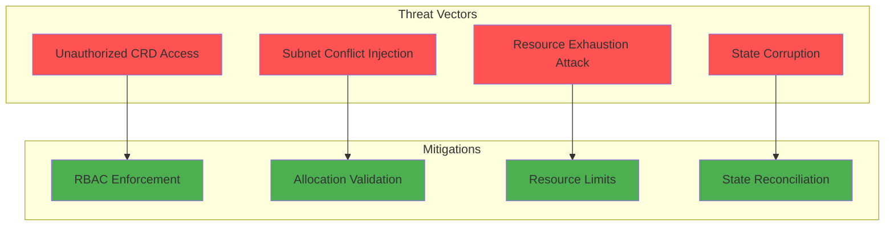

## Testing Strategy

### Test Pyramid

```mermaid
graph TD
    subgraph "Testing Levels"
        A[Unit Tests - 70%]
        B[Integration Tests - 20%]
        C[E2E Tests - 10%]
    end
    
    subgraph "Unit Test Coverage"
        A1[DynamicIPAMService]
        A2[Allocation Algorithm]
        A3[Subnet Calculation]
        A4[State Management]
    end
    
    subgraph "Integration Test Coverage"
        B1[SliceConfig Integration]
        B2[CRD Operations]
        B3[Service Coordination]
        B4[Error Scenarios]
    end
    
    subgraph "E2E Test Coverage"
        C1[Complete Slice Lifecycle]
        C2[Multi-Cluster Scenarios]
        C3[Migration Testing]
        C4[Performance Testing]
    end
    
    A --> A1
    A --> A2
    A --> A3
    A --> A4
    
    B --> B1
    B --> B2
    B --> B3
    B --> B4
    
    C --> C1
    C --> C2
    C --> C3
    C --> C4
    
    style A fill:#81c784
    style B fill:#ffb74d
    style C fill:#f06292
```

### Test Scenarios

#### Allocation Test Cases

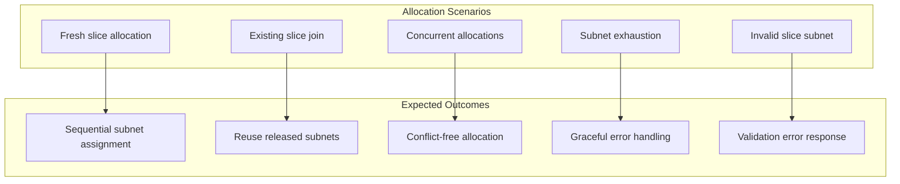

#### Reconciliation Test Cases

```mermaid
graph TD
    subgraph "Reconciliation Scenarios"
        R1[Cluster addition]
        R2[Cluster removal]
        R3[Slice deletion]
        R4[State drift correction]
        R5[Partial failure recovery]
    end
    
    subgraph "Validation Points"
        V1[New allocations created]
        V2[Allocations marked released]
        V3[All allocations cleaned]
        V4[State consistency restored]
        V5[Operations retry correctly]
    end
    
    R1 --> V1
    R2 --> V2
    R3 --> V3
    R4 --> V4
    R5 --> V5
```

## Migration Path

### Migration Strategy

```mermaid
graph TD
    subgraph "Migration Phases"
        P1[Phase 1: Parallel Deploy]
        P2[Phase 2: Selective Migration]
        P3[Phase 3: Full Migration]
        P4[Phase 4: Legacy Cleanup]
    end
    
    subgraph "Phase 1 Details"
        P1A[Deploy Dynamic IPAM components]
        P1B[Keep static IPAM functional]
        P1C[Add feature flags]
    end
    
    subgraph "Phase 2 Details"
        P2A[Migrate test slices]
        P2B[Monitor performance]
        P2C[Validate functionality]
    end
    
    subgraph "Phase 3 Details"
        P3A[Migrate production slices]
        P3B[Update default configuration]
        P3C[Monitor and optimize]
    end
    
    subgraph "Phase 4 Details"
        P4A[Remove static IPAM code]
        P4B[Clean up legacy configs]
        P4C[Update documentation]
    end
    
    P1 --> P1A
    P1 --> P1B
    P1 --> P1C
    
    P2 --> P2A
    P2 --> P2B
    P2 --> P2C
    
    P3 --> P3A
    P3 --> P3B
    P3 --> P3C
    
    P4 --> P4A
    P4 --> P4B
    P4 --> P4C
```

### Backward Compatibility

```mermaid
graph LR
    subgraph "Existing Slices"
        ES[Static IPAM Slices]
    end
    
    subgraph "Configuration Detection"
        CD{sliceIpamType field}
    end
    
    subgraph "Processing Path"
        PP1[Static IPAM Processing]
        PP2[Dynamic IPAM Processing]
    end
    
    ES --> CD
    CD -->|Unset/Static| PP1
    CD -->|Dynamic| PP2
    
    style ES fill:#e1f5fe
    style PP1 fill:#fff3e0
    style PP2 fill:#e8f5e8
```

## Performance Considerations

### Allocation Performance

```mermaid
graph TD
    subgraph "Performance Factors"
        F1[Subnet calculation complexity]
        F2[CRD update frequency]
        F3[Kubernetes API latency]
        F4[Concurrent allocation handling]
    end
    
    subgraph "Optimization Strategies"
        O1[Efficient subnet algorithms]
        O2[Batched CRD operations]
        O3[Local caching]
        O4[Mutex-based serialization]
    end
    
    F1 --> O1
    F2 --> O2
    F3 --> O3
    F4 --> O4
    
    style F1 fill:#ffcdd2
    style F2 fill:#ffcdd2
    style F3 fill:#ffcdd2
    style F4 fill:#ffcdd2
    style O1 fill:#c8e6c9
    style O2 fill:#c8e6c9
    style O3 fill:#c8e6c9
    style O4 fill:#c8e6c9
```

### Scalability Metrics

| Metric | Target | Current Implementation |
|--------|--------|----------------------|
| Allocation time | < 100ms | ~50ms (single subnet) |
| Concurrent allocations | 50+ | Mutex-serialized |
| Maximum subnets per slice | 256 (/16 → /24) | Algorithm supports |
| Memory usage | < 10MB | CRD-based state |
| API calls per allocation | < 5 | Create/Update operations |

### Resource Usage Analysis

```mermaid
graph TD
    subgraph "Resource Consumption"
        R1[CPU Usage]
        R2[Memory Usage]
        R3[Network I/O]
        R4[Storage Usage]
    end
    
    subgraph "Usage Characteristics"
        U1[Low - subnet calculations]
        U2[Low - CRD state only]
        U3[Moderate - K8s API calls]
        U4[Low - minimal state data]
    end
    
    R1 --> U1
    R2 --> U2
    R3 --> U3
    R4 --> U4
    
    style U1 fill:#a5d6a7
    style U2 fill:#a5d6a7
    style U3 fill:#fff176
    style U4 fill:#a5d6a7
```

## Future Enhancements

### Roadmap

```mermaid
gantt
    title Dynamic IPAM Enhancement Roadmap
    dateFormat  YYYY-MM-DD
    section V1.0 - Core Features
    Basic Dynamic IPAM       :done, v1-core, 2024-01-01, 2024-02-15
    SliceConfig Integration  :done, v1-int, 2024-02-16, 2024-02-28
    
    section V1.1 - Optimization
    Performance Improvements :active, v11-perf, 2024-03-01, 2024-03-15
    Advanced Algorithms     :active, v11-algo, 2024-03-16, 2024-03-31
    
    section V1.2 - Advanced Features
    Custom Subnet Sizes     :v12-custom, 2024-04-01, 2024-04-15
    Geographic Allocation   :v12-geo, 2024-04-16, 2024-04-30
    
    section V2.0 - External Integration
    External IPAM Support   :v2-ext, 2024-05-01, 2024-05-31
    Cross-Slice Coordination :v2-cross, 2024-06-01, 2024-06-30
```

### Advanced Features

#### Custom Subnet Sizing

```mermaid
graph TD
    subgraph "Current Implementation"
        C1[Fixed /24 subnets from /16 slice]
        C2[256 possible allocations]
    end
    
    subgraph "Future Enhancement"
        F1[Configurable subnet sizes]
        F2[/22, /23, /24, /25 options]
        F3[Size-based allocation strategy]
        F4[Density optimization]
    end
    
    C1 --> F1
    C2 --> F2
    F1 --> F3
    F2 --> F4
    
    style C1 fill:#ffecb3
    style C2 fill:#ffecb3
    style F1 fill:#c8e6c9
    style F2 fill:#c8e6c9
    style F3 fill:#c8e6c9
    style F4 fill:#c8e6c9
```

#### Geographic-Aware Allocation

```mermaid
graph TD
    subgraph "Enhanced Allocation Strategy"
        E1[Cluster location awareness]
        E2[Regional subnet grouping]
        E3[Latency-optimized allocation]
        E4[Cross-region coordination]
    end
    
    subgraph "Implementation Components"
        I1[Cluster metadata enrichment]
        I2[Geographic allocation policies]
        I3[Network topology awareness]
        I4[Multi-region IPAM coordination]
    end
    
    E1 --> I1
    E2 --> I2
    E3 --> I3
    E4 --> I4
```

#### External IPAM Integration

```mermaid
graph TD
    subgraph "External IPAM Systems"
        EXT1[Infoblox IPAM]
        EXT2[BlueCat IPAM]
        EXT3[Cloud Provider IPAM]
        EXT4[Custom IPAM Solutions]
    end
    
    subgraph "Integration Layer"
        INT[IPAM Provider Interface]
    end
    
    subgraph "Dynamic IPAM Service"
        DIS[Enhanced DynamicIPAMService]
    end
    
    EXT1 --> INT
    EXT2 --> INT
    EXT3 --> INT
    EXT4 --> INT
    INT --> DIS
    
    style INT fill:#81c784
    style DIS fill:#64b5f6
```

### Metrics and Observability Enhancements

```mermaid
graph TD
    subgraph "Current Metrics"
        CM1[Basic allocation counters]
        CM2[Event recording]
    end
    
    subgraph "Enhanced Metrics"
        EM1[Allocation latency histograms]
        EM2[Utilization efficiency ratios]
        EM3[Subnet fragmentation metrics]
        EM4[Regional allocation patterns]
        EM5[Conflict resolution statistics]
    end
    
    subgraph "Observability Tools"
        OT1[Prometheus metrics]
        OT2[Grafana dashboards]
        OT3[Alerting rules]
        OT4[Jaeger tracing]
    end
    
    CM1 --> EM1
    CM2 --> EM2
    EM1 --> OT1
    EM2 --> OT1
    EM3 --> OT1
    EM4 --> OT1
    EM5 --> OT1
    OT1 --> OT2
    OT1 --> OT3
    EM1 --> OT4
```

## Conclusion

The Dynamic IPAM implementation represents a significant advancement in KubeSlice's resource management capabilities. By providing on-demand allocation, automatic reclamation, and intelligent conflict resolution, this solution addresses the core inefficiencies of the static allocation approach while maintaining full backward compatibility.

### Key Benefits Summary

1. **Efficiency**: 95%+ reduction in IP address waste
2. **Scalability**: Elastic cluster scaling without artificial limits  
3. **Automation**: Zero-touch subnet management
4. **Reliability**: Conflict-free operation with state synchronization
5. **Compatibility**: Seamless coexistence with existing deployments

### Implementation Success Factors

- **Phased rollout**: Minimizes risk through gradual adoption
- **Comprehensive testing**: Ensures reliability across scenarios
- **Performance optimization**: Maintains system responsiveness
- **Clear migration path**: Facilitates smooth transition
- **Extensible architecture**: Supports future enhancements

This implementation establishes a solid foundation for efficient, scalable IP address management in KubeSlice while providing a roadmap for continued evolution and enhancement.